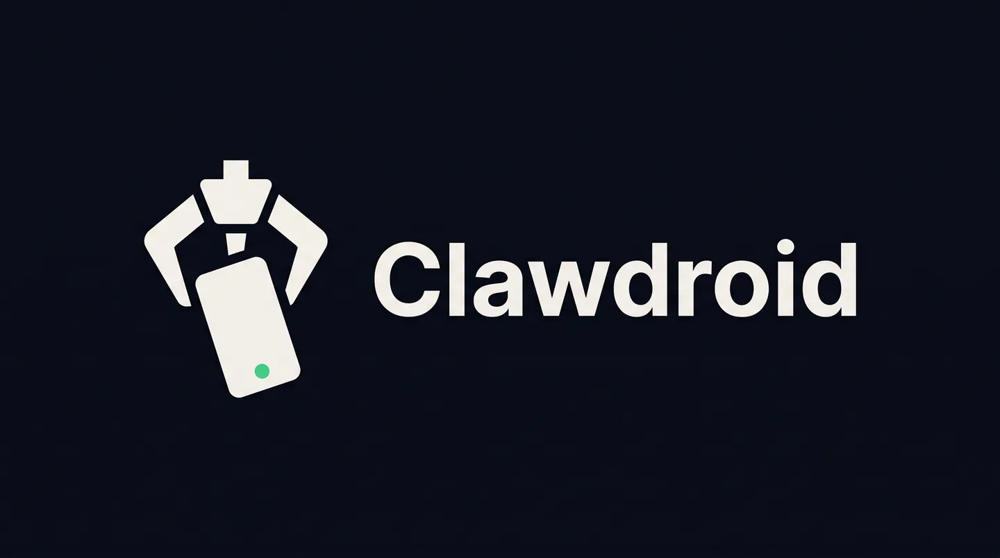
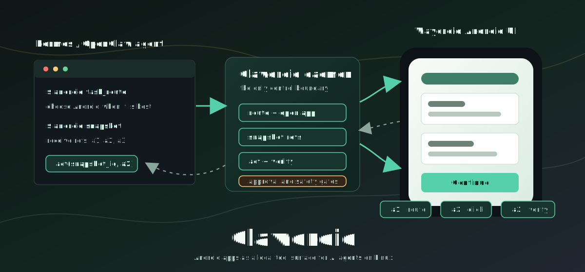
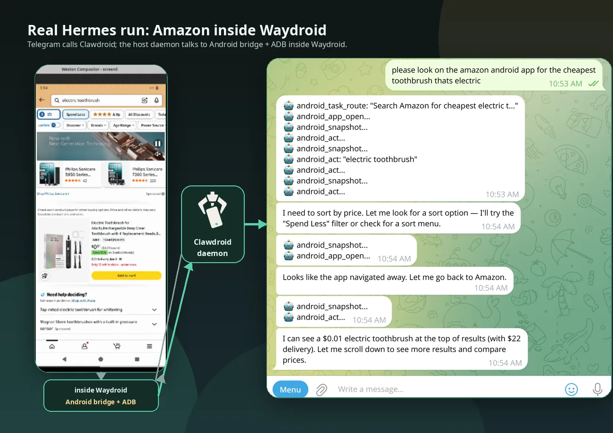
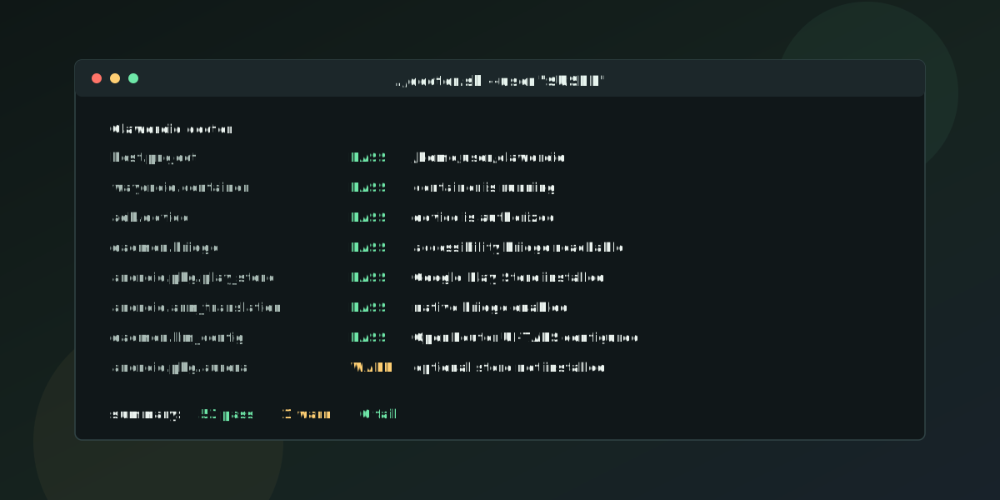
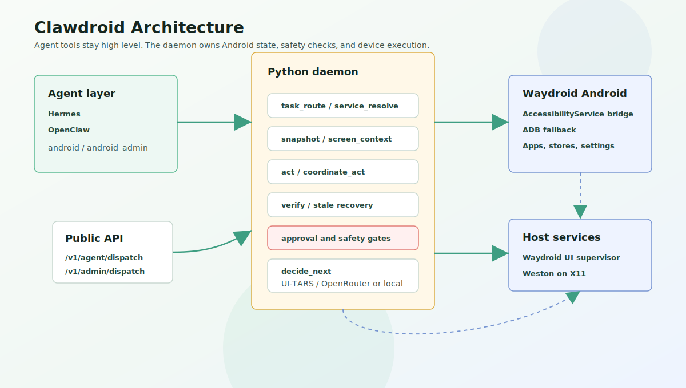
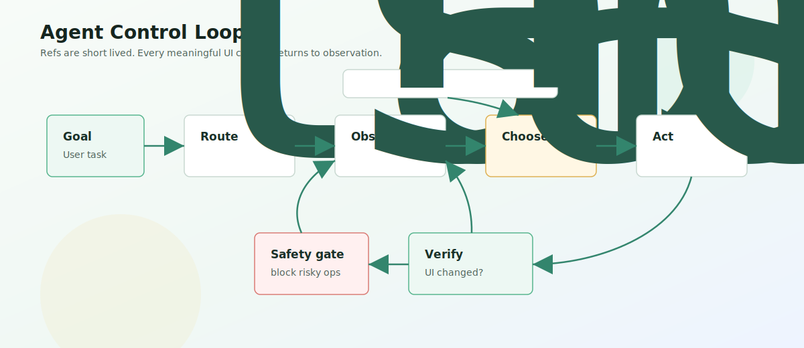
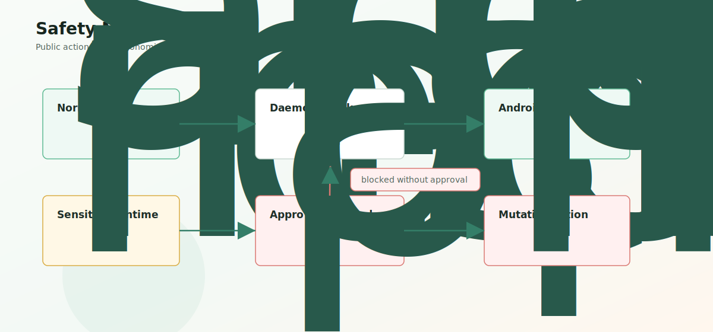
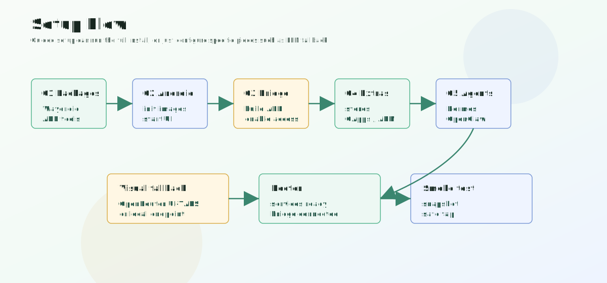
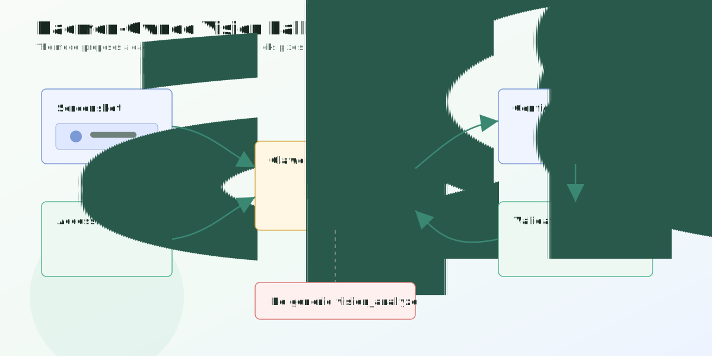

# Clawdroid

<p align="center">
  
</p>

Android apps as a local tool surface for AI agents on Linux.

Clawdroid lets Hermes and OpenClaw operate real Android apps through Waydroid. Agents route to an app, take a short-lived UI `snapshot`, act on refs such as `a1`, then verify and snapshot again. The daemon owns safety checks, the Android accessibility bridge, screenshots, ADB fallbacks, and optional vision fallback.

<p align="center">
  
</p>

## Live Example

This is a captured Hermes run: Telegram sends `android_*` tool calls, Clawdroid controls Amazon inside Waydroid, and the daemon reports back through the conversation.

<p align="center">
  
</p>

## Quick Start

Run guided setup from the repo root:

```bash
./setup_everything.sh
```

Guided setup can install host dependencies, initialize Waydroid, install the Android bridge, configure Hermes/OpenClaw, configure optional visual fallback, and run smoke checks.

Common one-shot installs:

```bash
# Hermes
./setup_everything.sh \
  --install-system-deps \
  --install-hermes-plugin \
  --init-waydroid \
  --extras microg \
  --smoke-test

# OpenClaw
./setup_everything.sh \
  --install-system-deps \
  --install-openclaw \
  --init-waydroid \
  --extras microg \
  --enable-admin-tool \
  --smoke-test

# Google Play / GApps instead of MicroG
./setup_everything.sh \
  --install-system-deps \
  --install-hermes-plugin \
  --init-waydroid \
  --with-gapps \
  --smoke-test
```

After installing the Hermes plugin, restart Hermes if setup did not do it for you:

```bash
sudo hermes gateway restart --system
```

If Android asks `Allow USB debugging?`, check **Always allow from this computer** and tap **Allow**.

## Verify It

Start with doctor:

```bash
./doctor.sh
./doctor.sh --repair --user "$USER"
```

Then run the smoke test:

```bash
./scripts/smoke_test_install.sh --layer auto --wait-timeout 360
```

Hermes checks:

```bash
hermes -t clawdroid -z 'Check Android status with the android tool'
hermes -t clawdroid -z \
  'Open Android settings, snapshot it, and report refs. Do not tap risky controls.'
```

Daemon and OpenClaw checks:

```bash
curl http://127.0.0.1:48765/v1/status | jq
openclaw plugins inspect android-waydroid --json
```

<p align="center">
  
</p>

## What You Get

- `android`: normal runtime tool for status, routing, app launch, snapshots, screenshots, ref actions, coordinate actions, waits, and optional `decide_next`.
- `android_admin`: opt-in host-control tool for recovery, Waydroid start/stop, installs, store helpers, extras, profiles, and bridge allowlists.
- Short-lived UI refs such as `a1`, `a2`, and `a3` instead of brittle app-specific selectors.
- Approval gates for installs, recovery, protected labels, and host/device mutation.
- Optional daemon-owned vision fallback with OpenRouter UI-TARS or a local OpenAI-compatible endpoint.

Typical agent loop:

```text
task_route(goal) -> app_open/url_open/store option
snapshot(snapshot_mode="interactive")
act(snapshot_id, ref, op)
snapshot again
```

## Requirements

- Linux with Waydroid support.
- A real Wayland session, or X11 with nested Weston. Clawdroid starts Weston automatically on X11.
- `sudo` for host packages, Waydroid init, image extras, and system recovery.
- Enough free disk for Waydroid images, Android app data, optional GApps, and ARM translation.

For servers without a desktop session, see [Headless server setup](docs/HEADLESS_SERVER.md).

## Setup Options

Defaults:

```text
Daemon:                http://127.0.0.1:48765
Android bridge:        127.0.0.1:49317
ARM translation:       libndk
Device profile:        samsung-galaxy-s24-ultra
Default stores:        F-Droid, Aurora Store, Aptoide
```

Useful flags:

```text
--interactive                      Guided mode
--yes                              Guided defaults without prompts
--sudo-mode manual                 Print root commands instead of inline sudo
--arm-translation libndk|libhoudini|both|none
--with-gapps / --extras gapps      Install Google framework / Play Store support
--skip-default-stores              Skip F-Droid, Aurora Store, and Aptoide
--device-profile NAME              Apply a different Android profile
--daemon-base-url URL              Configure a non-default daemon URL
--llm-provider openrouter|local|custom|skip
                                   Configure Android visual fallback
--configure-llm-only               Configure visual fallback only
--smoke-test                       Run post-install smoke checks
```

Explicit Hermes/OpenClaw paths:

```bash
./setup_everything.sh \
  --hermes-home /home/alice/.hermes \
  --hermes-user alice \
  --openclaw-home /home/alice/.openclaw \
  --openclaw-config /home/alice/.openclaw/openclaw.json \
  --daemon-base-url http://127.0.0.1:48765 \
  --install-hermes-plugin \
  --smoke-test
```

For root/system Hermes, use `--hermes-system` and, if needed, `--hermes-home /root/.hermes`.

## Visual Fallback

Configure the daemon-owned vision model during guided setup, or later:

```bash
./setup_everything.sh \
  --configure-llm-only \
  --llm-provider openrouter \
  --llm-api-key-env OPENROUTER_API_KEY
```

Local OpenAI-compatible endpoint:

```bash
./setup_everything.sh --configure-llm-only \
  --llm-provider local \
  --llm-base-url http://127.0.0.1:8000/v1 \
  --llm-model bytedance/ui-tars-1.5-7b
```

Config lives at `~/.config/openclaw-android-waydroid/llm.json`. Saved keys live in `~/.config/openclaw-android-waydroid/env` with user-only permissions. Skills should use daemon-backed `decide_next` only when `status.llm.configured` and `status.llm.supports_images` are true.

## Google Play, Stores, And ARM Apps

Use MicroG for most installs:

```bash
./setup_everything.sh --extras microg
```

Use GApps when you need Play Store or Google Play Services:

```bash
./setup_everything.sh --with-gapps
```

On an existing Waydroid image:

```bash
./scripts/install_waydroid_extras.sh --extras gapps
sudo ./scripts/restart_everything_sudo.sh
```

Play Store may require Google device certification. Clawdroid can print the Android ID and open the registration page:

```bash
./scripts/google_play_certification.sh --open-url
```

Register the ID at <https://www.google.com/android/uncertified>, wait for propagation, then restart Waydroid if Play Store still reports the device as uncertified.

## Reset Or Uninstall

Remove Clawdroid services/plugins while keeping the Waydroid image:

```bash
./scripts/uninstall_everything.sh --user "$USER"
```

Reset everything, including Waydroid and repo-local caches:

```bash
./scripts/uninstall_everything.sh \
  --user "$USER" \
  --purge-waydroid \
  --purge-repo-cache
```

After a purge, rerun guided setup or a fully flagged setup command.

## How It Works

<p align="center">
  
</p>

<p align="center">
  
</p>

<p align="center">
  
</p>

<p align="center">
  
</p>

<p align="center">
  
</p>

## Runtime Notes

If setup succeeds but Android is not visible:

```bash
sudo ./scripts/restart_everything_sudo.sh
```

`restart_everything_sudo.sh` performs a real Waydroid container restart by default and waits for Android/daemon readiness. Use `--soft` for a lighter UI/service reset that keeps the running container.

Docker setup probe:

```bash
sudo ./scripts/docker_smoke_setup.sh
```

The Docker probe validates the public setup path without touching the host Waydroid install. It still depends on host binder/cgroup/privilege support.

## More Docs

- [Architecture](docs/ARCHITECTURE.md)
- [Headless server setup](docs/HEADLESS_SERVER.md)
- [Public release checklist](docs/PUBLIC_RELEASE.md)
- [OpenClaw plugin](openclaw-plugin/README.md)
- [Hermes plugin](hermes-plugin/README.md)
- [Python daemon](python-daemon/README.md)
- [Android companion app](android-companion/README.md)
